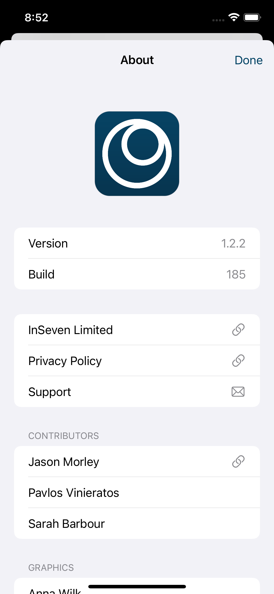
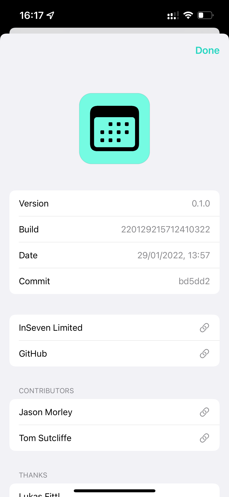
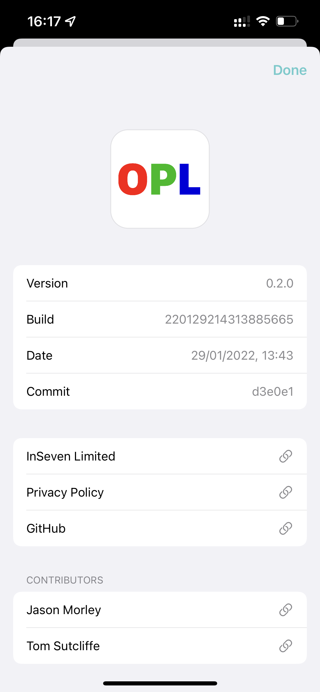

# Diligence

About screens for macOS and iOS

## Overview

Diligence is a lightweight Swift package with a collection UI controls for building abotu screens for macOS and iOS apps. Its primary use goal in establishing a consistent look and feel across the [InSeven Limited](https://github.com/inseven) apps.

## Screenshots

| Anytime                        | StatusPanel                            | OPL                    |
| ------------------------------ | -------------------------------------- | ---------------------- |
|  |  |  |
