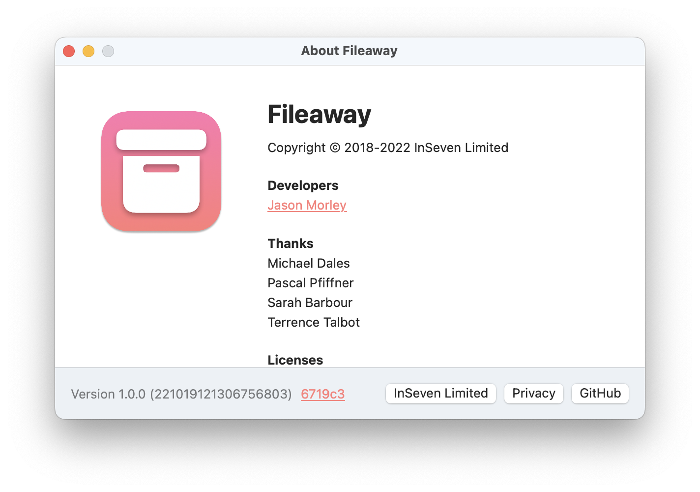

# Diligence

[](https://github.com/inseven/diligence/actions/workflows/build.yaml)

SwiftUI About Screens

## Overview

Diligence is a lightweight Swift package with a collection UI controls for building about screens for macOS and iOS apps.

## Screenshots

### iOS

| Anytime                            | StatusPanel                                | OPL                        |
| ---------------------------------- | ------------------------------------------ | -------------------------- |
|  |  |  |

### macOS


## Build Numbers

Diligence supports build numbers conforming to the following structure:

```
YYmmddHHMMxxxxxxxx
```

- `YY` -- two-digit year
- `mm` -- month
- `dd` -- day
- `HH` -- hours (24h)
- `MM` -- minutes
- `xxxxxxxx` -- zero-padded integer representation of a 6-character commit SHA

These build numbers are guaranteed to be always incrementing and, as such, safe to be used for iOS and macOS apps while also encoding the build date and commit.

If Diligence detects a build number in this format, it will display this additional information in the about screen.

#### Generating Build Numbers

Diligence comes with a Swift command-line script that can be used to generate suitable build numbers. From the root Diligence directory, run the following command:

```bash
scripts/build-number.swift
221021001716408432
```

This can be injected into your project build by building from the command line and setting the `CURRENT_PROJECT_VERSION` environment variable. For example, the command line to archive a release build for the TinyBoard project is as follows:

```bash
BUILD_NUMBER=`diligence/scripts/build-number.swift`
xcode_project \
    -scheme "TinyBoard" \
    -config Release \
    CURRENT_PROJECT_VERSION=$BUILD_NUMBER \
    archive
```

## Usage

### iOS

```swift
AboutView {
  Action("InSeven Limited", url: URL(string: "https://inseven.co.uk")!)
  Action("Privacy Policy", url: URL(string: "https://anytime.world/privacy-policy")!)
  Action("Support", url: URL(address: "support@anytime.world", subject: "Anytime Support")!)
} acknowledgements: {
  Acknowledgements("Contributors") {
    Credit("Jason Morley", url: URL(string: "https://jbmorley.co.uk"))
    Credit("Pavlos Vinieratos", url: URL(string: "https://github.com/pvinis"))
    Credit("Sarah Barbour")
  }
  Acknowledgements("Graphics") {
    Credit("Anna Wilk")
  }
  Acknowledgements("Thanks") {
    Credit("Blake Merryman")
    Credit("Joanne Wong")
    Credit("Johannes Weiß")
    Credit("Lukas Fittl")
    Credit("Michael Dales")
    Credit("Michi Spevacek")
    Credit("Mike Rhodes")
    Credit("Sara Frederixon")
    Credit("Terrence Talbot")
    Credit("Tom Sutcliffe")
  }
} licenses: {
  License("Introspect", author: "Timber Software", filename: "introspect-license")
}
```

### macOS

```swift
import SwiftUI

import Diligence

@main
struct BookmarksApp: App {

    var body: some Scene {
        WindowGroup {
            ContentView()
        }

        About {
            Action("InSeven Limited", url: URL(string: "https://inseven.co.uk")!)
            Action("Support", url: URL(address: "support@inseven.co.uk", subject: "Bookmarks Support")!)
        } acknowledgements: {
            Acknowledgements("Developers") {
                Credit("Jason Morley", url: URL(string: "https://jbmorley.co.uk"))
            }
            Acknowledgements("Thanks") {
                Credit("Blake Merryman")
                Credit("Joanne Wong")
                Credit("Lukas Fittl")
                Credit("Pavlos Vinieratos")
                Credit("Sara Frederixon")
                Credit("Sarah Barbour")
                Credit("Terrence Talbot")
            }
        } licenses: {
            License("Binding+mappedToBool", author: "Joseph Duffy", filename: "Binding+mappedToBool")
            License("Diligence", author: "Jason Morley", filename: "Diligence")
            License("Interact", author: "Jason Morley", filename: "interact-license")
            License("Introspect", author: "Timber Software", filename: "Introspect")
            License("SQLite.swift", author: "Stephen Celis", filename: "SQLite-swift")
            License("TFHpple", author: "Topfunky Corporation", filename: "TFHpple")
        }

    }
}
```

### Caveats

Diligence currently makes some assumptions that will be addressed in future updates:

- Diligence expects to find an image asset named "Icon" in your application's main bundle containing your icon.
