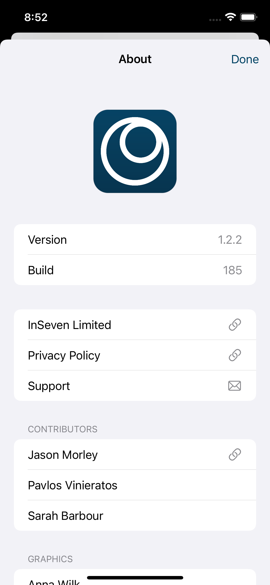
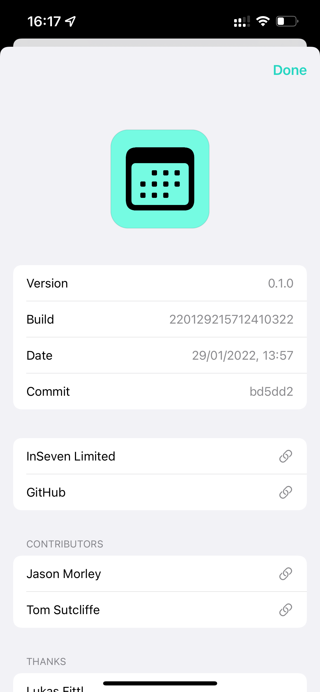
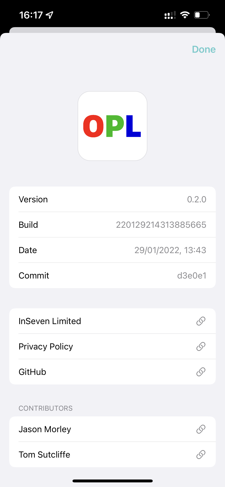
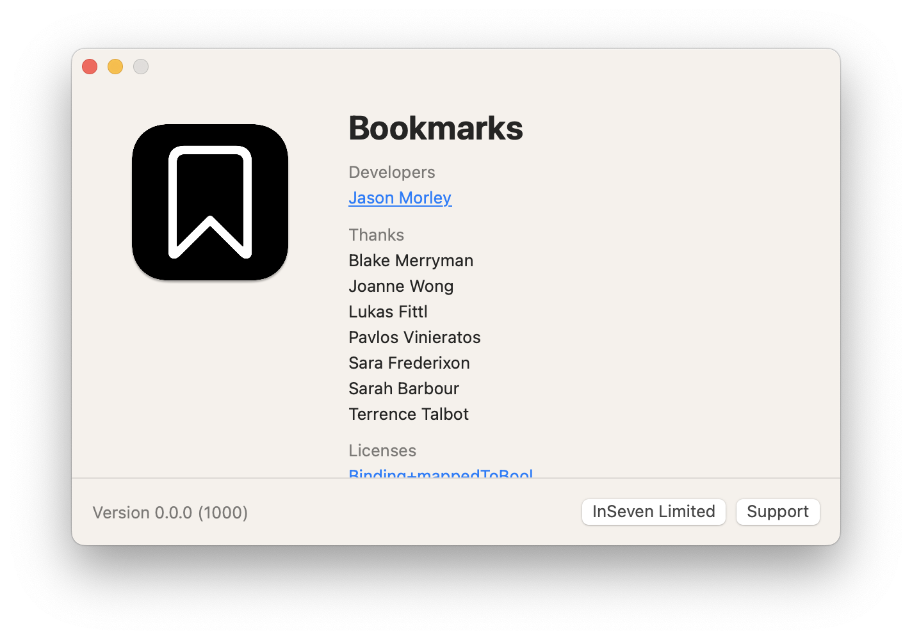

# Diligence

SwiftUI about screens for macOS and iOS

## Overview

Diligence is a lightweight Swift package with a collection UI controls for building abotu screens for macOS and iOS apps. Its primary use goal in establishing a consistent look and feel across the [InSeven Limited](https://github.com/inseven) apps.

## Screenshots

### iOS

| Anytime                            | StatusPanel                                | OPL                        |
| ---------------------------------- | ------------------------------------------ | -------------------------- |
|  |  |  |

### macOS


## Usage

#### macOS

```swift
import SwiftUI

import Diligence

@main
struct BookmarksApp: App {

    var body: some Scene {
        WindowGroup {
            ContentView()
        }

        About {
            Action("InSeven Limited", url: URL(string: "https://inseven.co.uk")!)
            Action("Support", url: URL(address: "support@inseven.co.uk", subject: "Bookmarks Support")!)
        } acknowledgements: {
            Acknowledgements("Developers") {
                Credit("Jason Morley", url: URL(string: "https://jbmorley.co.uk"))
            }
            Acknowledgements("Thanks") {
                Credit("Blake Merryman")
                Credit("Joanne Wong")
                Credit("Lukas Fittl")
                Credit("Pavlos Vinieratos")
                Credit("Sara Frederixon")
                Credit("Sarah Barbour")
                Credit("Terrence Talbot")
            }
        } licenses: {
            License("Binding+mappedToBool", author: "Joseph Duffy", filename: "Binding+mappedToBool")
            License("Diligence", author: "InSeven Limited", filename: "Diligence")
            License("Interact", author: "InSeven Limited", filename: "interact-license")
            License("Introspect", author: "Timber Software", filename: "Introspect")
            License("SQLite.swift", author: "Stephen Celis", filename: "SQLite-swift")
            License("TFHpple", author: "Topfunky Corporation", filename: "TFHpple")
        }

    }
}
```

### Caveats

Diligence currently makes some assumptions that will be addressed in future updates:

- Diligence expects to find an image asset named "Icon" in your application's main bundle containing your icon.
- License files should be resources on your apps main bundle.
